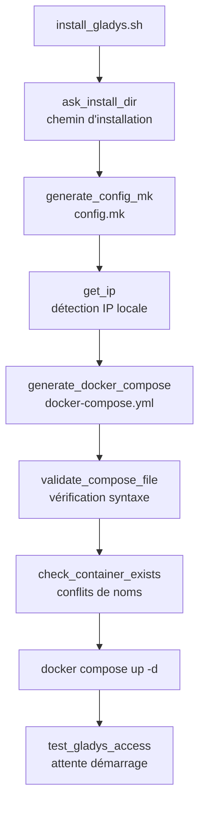
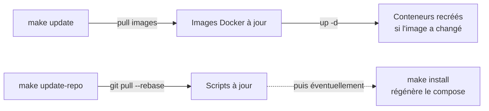

# Architecture
{: .no_toc }

Comment les pièces du dépôt s'assemblent, et pourquoi.
{: .fs-5 .fw-300 }

## Sommaire
{: .no_toc .text-delta }

1. TOC
{:toc}

---

## Vue d'ensemble

```
HomeLAB/
├── common/
│   └── utils.sh              # fonctions partagées entre tous les services
├── GladysAssistant/
│   ├── install_gladys.sh     # génère la config et démarre la stack
│   ├── makefile              # cycle de vie au quotidien
│   ├── CHANGELOG.md
│   └── VERSION.md
└── docs/                     # cette documentation
```

Chaque service est autonome dans son dossier. Le seul élément partagé est
`common/utils.sh`.

## Le compose est généré, pas versionné

C'est la décision structurante du dépôt : les fichiers `docker-compose.yml`
**ne sont pas dans le dépôt**. Ils sont produits par le script d'installation.



**Pourquoi ce choix ?**

- La configuration s'adapte à la machine cible : chemin d'installation choisi à
  l'exécution, adresse IP détectée automatiquement.
- Pas de variantes de fichiers à maintenir dans le dépôt selon les machines.
- Le script documente la configuration *et* la produit : la documentation et le
  résultat réel ne peuvent pas se désynchroniser.

**Conséquence pratique :** le `.gitignore` exclut explicitement ces artefacts.

```
GladysAssistant/docker-compose.yml
GladysAssistant/config.mk
```

{: .avertissement }
> Corollaire : ne modifiez pas directement un `docker-compose.yml` généré. Il
> serait écrasé au prochain `make install`. Modifiez le script, qui est la
> source de vérité.

### Validation avant lancement

Comme le compose est produit par un *heredoc* dans le script, une erreur de
syntaxe YAML n'apparaîtrait qu'au moment du lancement. La fonction
`validate_compose_file` exécute donc `docker compose config -q` sur le fichier
généré **avant** toute tentative de démarrage, et s'arrête avec le message
d'erreur de Docker si le fichier est invalide.

## Utilitaires partagés : `common/utils.sh`

Ce fichier regroupe ce qui serait sinon dupliqué dans chaque service :

| Fonction | Rôle |
|---|---|
| `log`, `log_info`, `log_warn`, `log_error`, `log_success` | Journalisation colorée et horodatée |
| `command_exists` | Teste la présence d'une commande |
| `check_dependencies` | Vérifie les outils requis avant de continuer |
| `check_docker_running` | Vérifie que le démon Docker répond |
| `check_docker_compose` | Vérifie la présence de Compose |
| `validate_compose_file` | Valide la syntaxe d'un fichier compose |
| `check_container_exists` | Détecte les conflits de noms de conteneurs |
| `generate_config_mk` | Écrit le `config.mk` lu par le makefile |
| `update_repo` | Met à jour le dépôt Git |

### Niveaux de journalisation

Seul le niveau `INFO` est conditionné à l'option `--verbose`. Les niveaux
`WARN`, `ERROR` et `SUCCESS` sont **toujours affichés** : un script qui
s'interrompt doit expliquer pourquoi, même sans mode verbeux.

```bash
make install              # affiche avertissements, erreurs et succès
make install ARGS="-v"    # ajoute le détail des étapes
```

### Résolution du chemin, avec repli

Les scripts cherchent `utils.sh` à deux emplacements, dans cet ordre :

1. `../common/utils.sh` — l'emplacement normal ;
2. `./utils.sh` — repli pour un clonage partiel ne contenant pas `common/`.

La résolution se fait relativement à l'emplacement du script (et non au
répertoire courant), ce qui permet de le lancer depuis n'importe où :

```bash
/home/william/App/HomeLAB/GladysAssistant/install_gladys.sh --help   # fonctionne
```

Si aucun des deux emplacements ne contient le fichier, le script s'arrête en
indiquant la commande `sparse-checkout` à utiliser.

## Le fichier `config.mk`

`generate_config_mk` écrit le chemin d'installation choisi, que le `makefile`
lit ensuite pour savoir où agir :

```makefile
# Fichier de configuration généré automatiquement
INSTALL_DIR := /opt/gladys
```

{: .note }
> La valeur est écrite **sans guillemets** et avec `:=`. Make traite les
> guillemets comme faisant partie de la valeur, ce qui produirait des commandes
> du type `cd ""/opt/gladys""` — cassées dès qu'un chemin contient un espace.

Si `config.mk` est absent, le makefile se replie sur son propre répertoire
(`CURDIR`), pour éviter d'exécuter des commandes dans un répertoire arbitraire.

## Clonage partiel (sparse-checkout)

Le dépôt regroupant plusieurs services, il est possible de ne récupérer que
celui qui vous intéresse :

```bash
git clone --filter=blob:none --sparse https://github.com/William-De71/HomeLAB.git
cd HomeLAB
git sparse-checkout set common GladysAssistant
```

- `--filter=blob:none` — ne télécharge pas le contenu des fichiers hors périmètre ;
- `--sparse` — n'extrait initialement que la racine ;
- `sparse-checkout set` — sélectionne les dossiers à matérialiser sur le disque.

### Comportement lors d'une mise à jour

Question légitime : un `git pull` va-t-il récupérer les autres services ?

**Non.** Le répertoire de travail continue de ne contenir que les dossiers
sélectionnés. Concrètement, si un nouveau service est ajouté en amont :

| Élément | Comportement lors du `pull` |
|---|---|
| `GladysAssistant/` modifié en amont | ✅ Mis à jour sur le disque |
| `common/utils.sh` corrigé en amont | ✅ Mis à jour sur le disque |
| Nouveau service ajouté en amont | ⬜ Ignoré, rien n'apparaît |

{: .note }
> Le résumé du `pull` mentionnera malgré tout les fichiers hors périmètre
> (`3 files changed`). C'est normal : Git télécharge l'**historique** complet,
> qui est indivisible, mais n'écrit sur le disque que les chemins autorisés par
> le `sparse-checkout`. Avec `--filter=blob:none`, le contenu de ces fichiers
> n'est même pas transféré.

### Ajouter un service par la suite

Sans re-cloner :

```bash
git sparse-checkout add NomDuService
```

### Vérifier le périmètre courant

```bash
git sparse-checkout list
```

## Mises à jour : deux niveaux distincts

La distinction est importante car les deux cibles ne touchent pas aux mêmes
éléments :

| Cible | Agit sur | Commande sous-jacente |
|---|---|---|
| `make update` | Les **images Docker** | `docker compose pull` + `up -d` |
| `make update-repo` | Les **scripts** du dépôt | `git pull --rebase` |



{: .astuce }
> Après un `make update-repo` ayant modifié le script d'installation, relancez
> `make install` pour régénérer le `docker-compose.yml` avec les changements.

## Conventions

- **Un dossier par service**, nommé d'après le service.
- **Scripts en `bash`** avec `set -euo pipefail`, validés par `shellcheck -x`.
- **Fonctions documentées** en en-tête (`FUNCTION`, `DESC`, `ARGS`, `OUTS`, `RETS`).
- **Images épinglées** (jamais `latest` pour les services), pour des
  installations reproductibles.
- **Journalisation** via `common/utils.sh`, pas de `echo` brut pour les messages
  d'état.
- **`CHANGELOG.md`** par service, au format
  [Keep a Changelog](https://keepachangelog.com/fr/1.0.0/).
