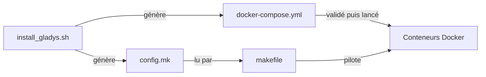

# HomeLAB
{: .no_toc }

Scripts d'installation des services Docker de mon homelab.
{: .fs-6 .fw-300 }

[Démarrer]({{ site.baseurl }}/prerequis/){: .btn .btn-primary .mr-2 }
[Voir sur GitHub](https://github.com/William-De71/HomeLAB){: .btn }

---

## Objectif

Ce dépôt répertorie les installations Docker de mon homelab. Chaque service
dispose de son propre dossier contenant :

- un **script d'installation** qui génère la configuration et démarre la stack ;
- un **`makefile`** pour piloter le cycle de vie du service au quotidien ;
- un **`README.md`** propre au service.

L'objectif est qu'un service se réinstalle sur une machine neuve avec deux
commandes, sans avoir à se souvenir de la configuration exacte.

## Services disponibles

| Service | Description | Documentation |
|---|---|---|
| **Gladys Assistant** | Domotique auto-hébergée | [Documentation]({{ site.baseurl }}/services/gladys/) |

## Principe de fonctionnement

Le point à retenir avant de lire le reste : **les fichiers
`docker-compose.yml` ne sont pas versionnés dans ce dépôt.** Ils sont générés
par les scripts d'installation, qui restent la source de vérité.



Cette approche permet d'adapter la configuration à la machine cible (chemins,
adresse IP détectée) sans multiplier les variantes de fichiers dans le dépôt.
Les détails sont expliqués dans [Architecture]({{ site.baseurl }}/architecture/).

## Prise en main rapide

```bash
# 1. Cloner le dépôt (uniquement le service voulu + les utilitaires partagés)
git clone --filter=blob:none --sparse https://github.com/William-De71/HomeLAB.git
cd HomeLAB
git sparse-checkout set common GladysAssistant

# 2. Installer le service
cd GladysAssistant
make install
```

{: .avertissement }
> N'oubliez pas d'inclure `common` dans le `sparse-checkout` : les fonctions
> partagées (`common/utils.sh`) y sont stockées et les scripts en ont besoin.

## Organisation du dépôt

```
HomeLAB/
├── common/
│   └── utils.sh              # fonctions partagées (logs, vérifications Docker…)
├── GladysAssistant/
│   ├── install_gladys.sh     # script d'installation
│   ├── makefile              # cycle de vie du service
│   ├── README.md
│   ├── CHANGELOG.md
│   └── VERSION.md
├── docs/                     # cette documentation
└── README.md
```

## Pour aller plus loin

- [Prérequis]({{ site.baseurl }}/prerequis/) — installer Docker et Docker Compose
- [Architecture]({{ site.baseurl }}/architecture/) — comment les pièces s'assemblent
- [Services]({{ site.baseurl }}/services/) — documentation par service
- [Ajouter un service]({{ site.baseurl }}/contribuer/) — checklist pour étendre le dépôt

---

## Licence

Distribué sous licence MIT. Voir le fichier
[LICENSE](https://github.com/William-De71/HomeLAB/blob/main/LICENSE).
